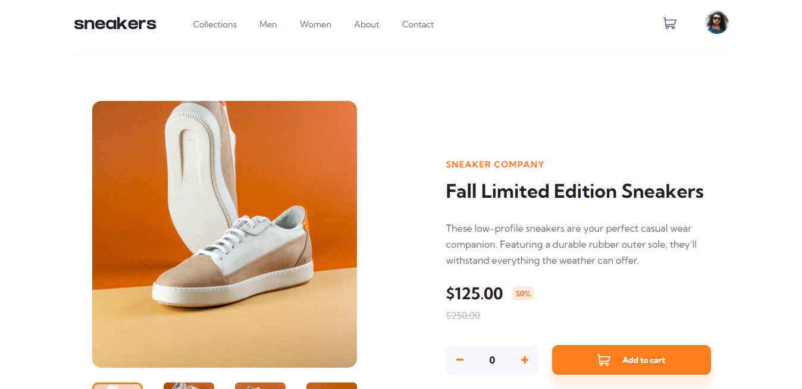
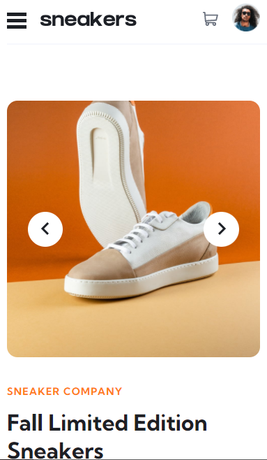

# Frontend Mentor - E-commerce product page solution

This is a solution to the [E-commerce product page challenge on Frontend Mentor](https://www.frontendmentor.io/challenges/ecommerce-product-page-UPsZ9MJp6). Frontend Mentor challenges help you improve your coding skills by building realistic projects.

## Table of contents

-   [Overview](#overview)
-   [The challenge](#the-challenge)
-   [Screenshot](#screenshot)
-   [Links](#links)
-   [Built with](#built-with)
-   [What I learned](#what-i-learned)
-   [Author](#author)

## Overview

E-commerce landing page made with love.

### The challenge

Users should be able to:

-   View the optimal layout for the site depending on their device's screen size
-   See hover states for all interactive elements on the page
-   Switch the large product image by clicking on the small thumbnail images
-   Add items to the cart
-   View the cart and remove items from it

### Screenshot

### Links

-   Solution URL: [Add solution URL here](https://your-solution-url.com)
-   Live Site URL: [Add live site URL here](https://your-live-site-url.com)

### Built with

-   html
-   CSS
-   Flexbox
-   CSS Grid
- vanilla js

### What I learned

this project was the most challenging to me, i learned a lot and lot. wow!

## Author

-   instgram account - [@issam_4real](https://www.instagram.com/issam_4real/)
-   Frontend Mentor - [@issam-hub](https://www.frontendmentor.io/profile/issam-hub)
